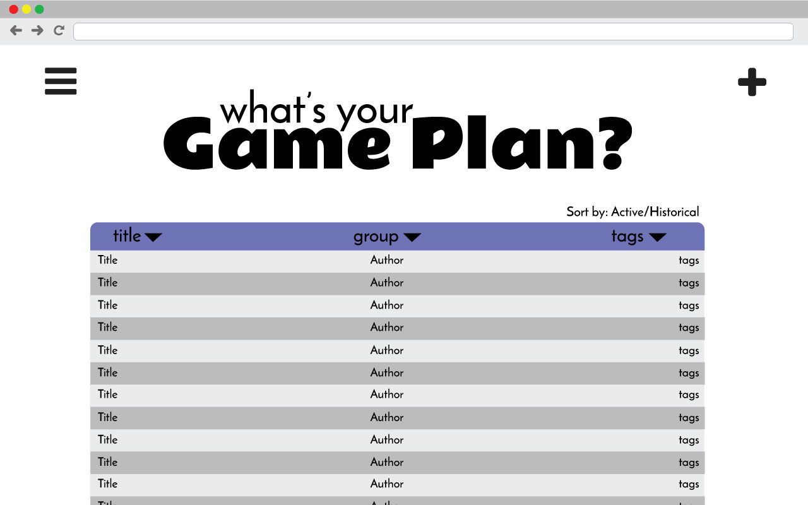
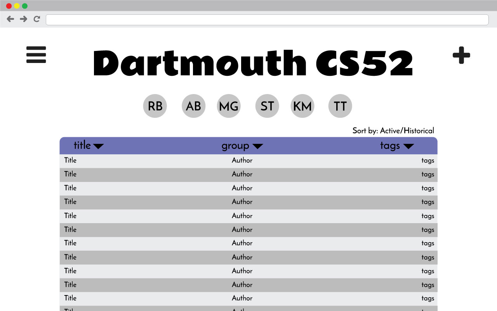
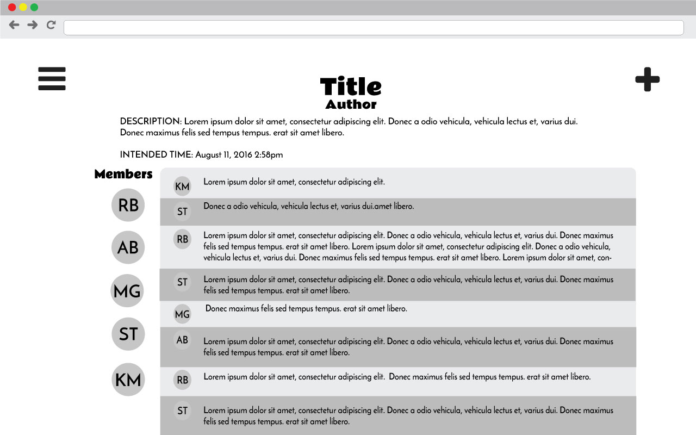
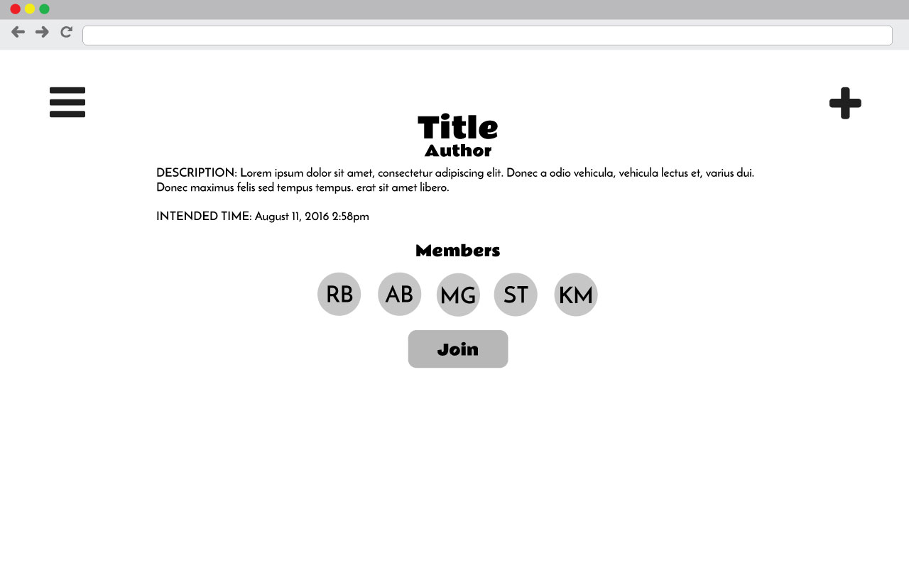
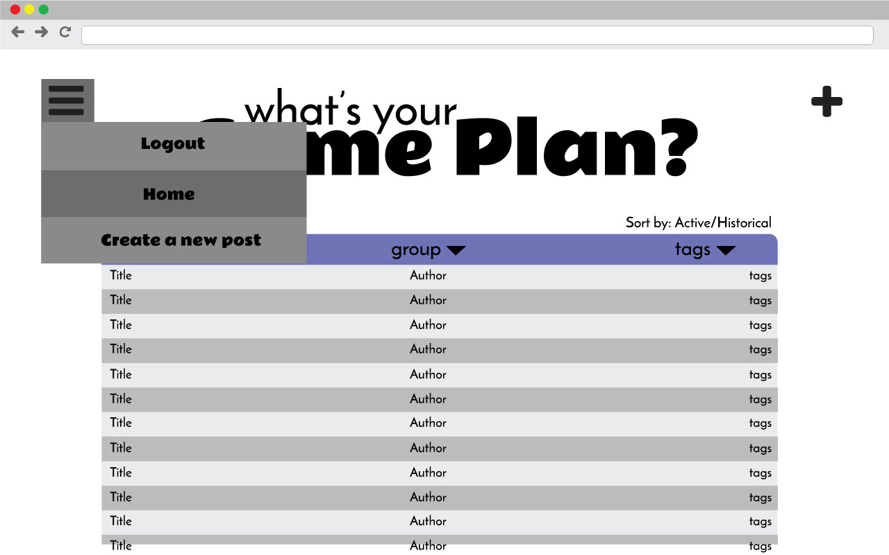

# Game Plan
GamePlan is a web application to facilitate group planning and coordination of events. The app strives to encourage users to step outside their comfort zones and do things they normally never take the tim to do! Users can create or be added to groups of other members, and then post event ideas to any groups that they are part of. When a user “likes” a post, they are put in a group chat with all other people who have liked that post, so they can easily communicate about planning this event.

### Home Page/Feed

### Group View

### Chat View

### Post View (Not a member)

### Side Menu

## Architecture
- firebase/socket for chat → ask Tim if this is ok
-
TODO:  descriptions of code organization and tools and libraries used

## Setup
-
TODO: how to get the project dev environment up and running, npm install etc

## Deployment

TODO: how to deploy the project

## Authors
Alex Beals
Kyra Maxwell
Manmeet Gujral
Ross Bower
Sydni Topper

## Acknowledgments
We would like to thank Tim for being Tim and also Basil Beals.
