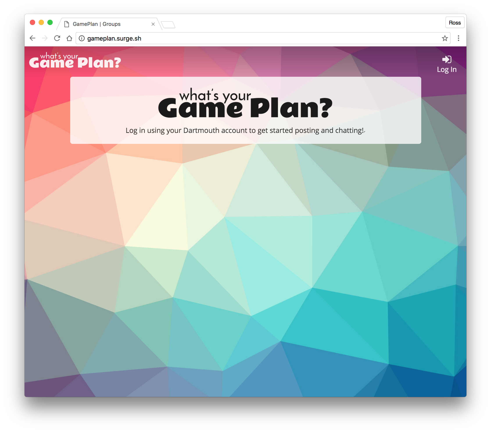
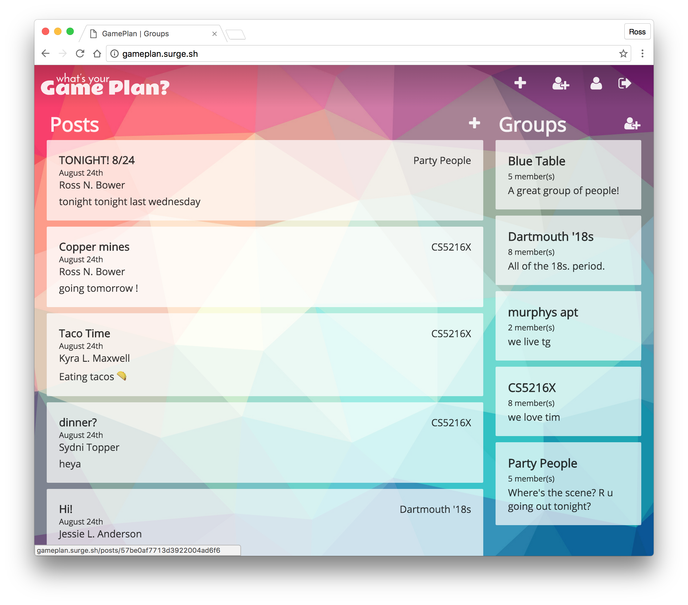
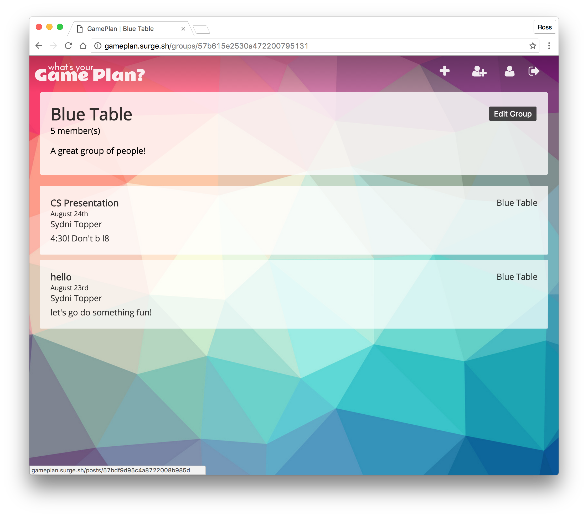
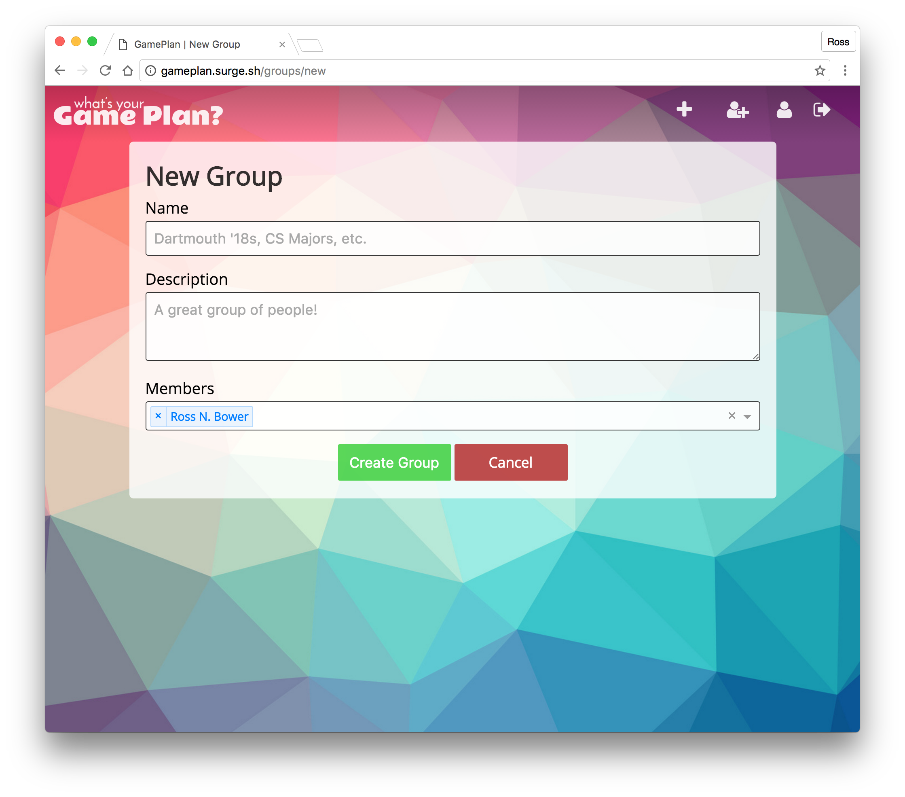
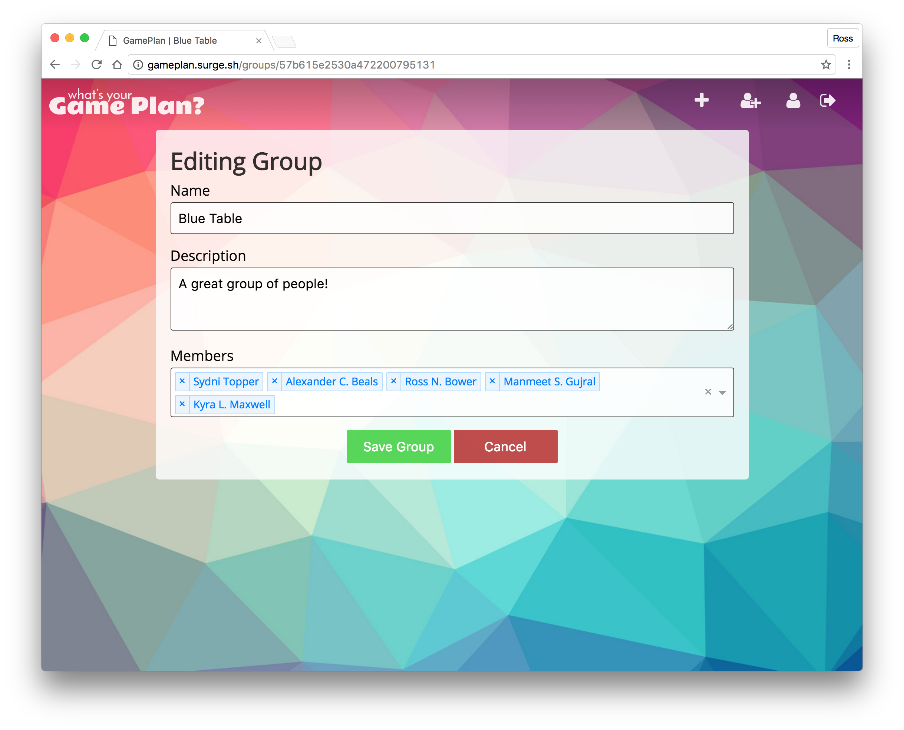
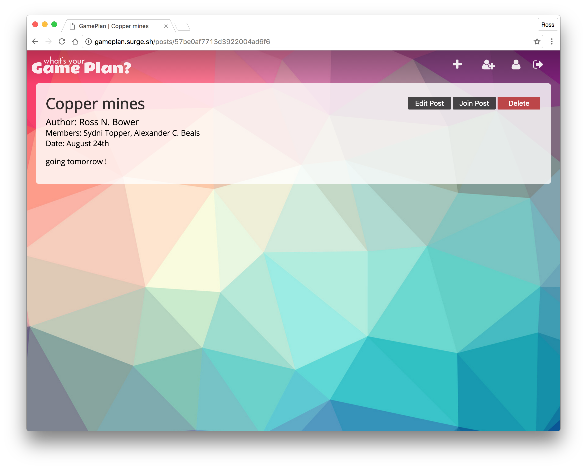
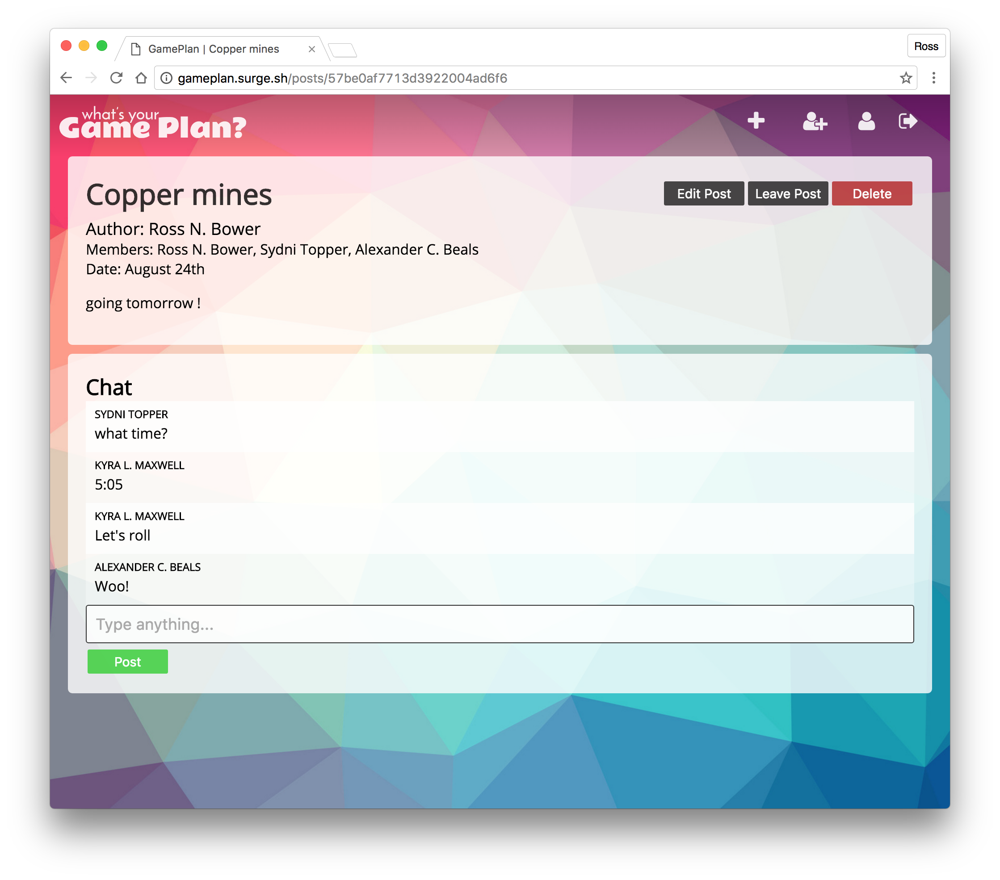
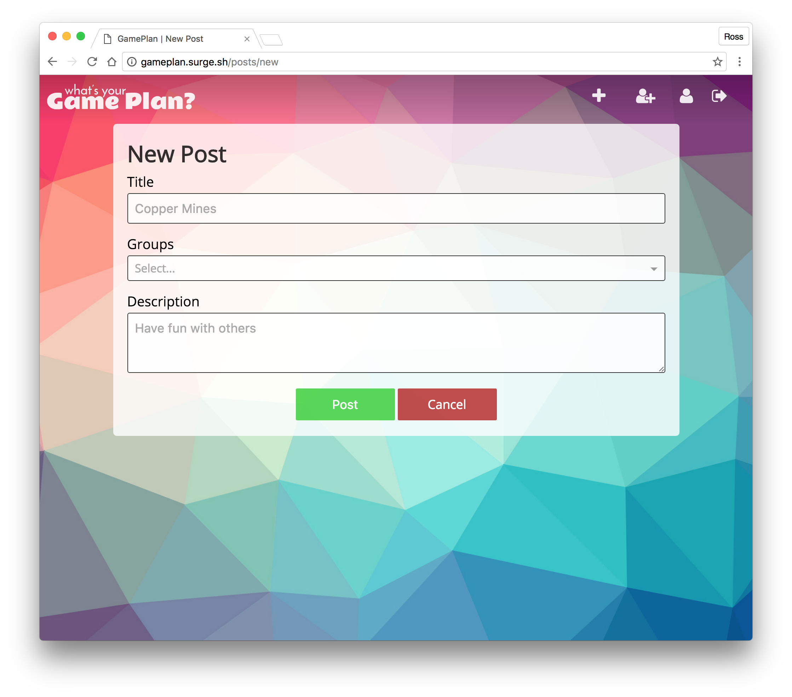
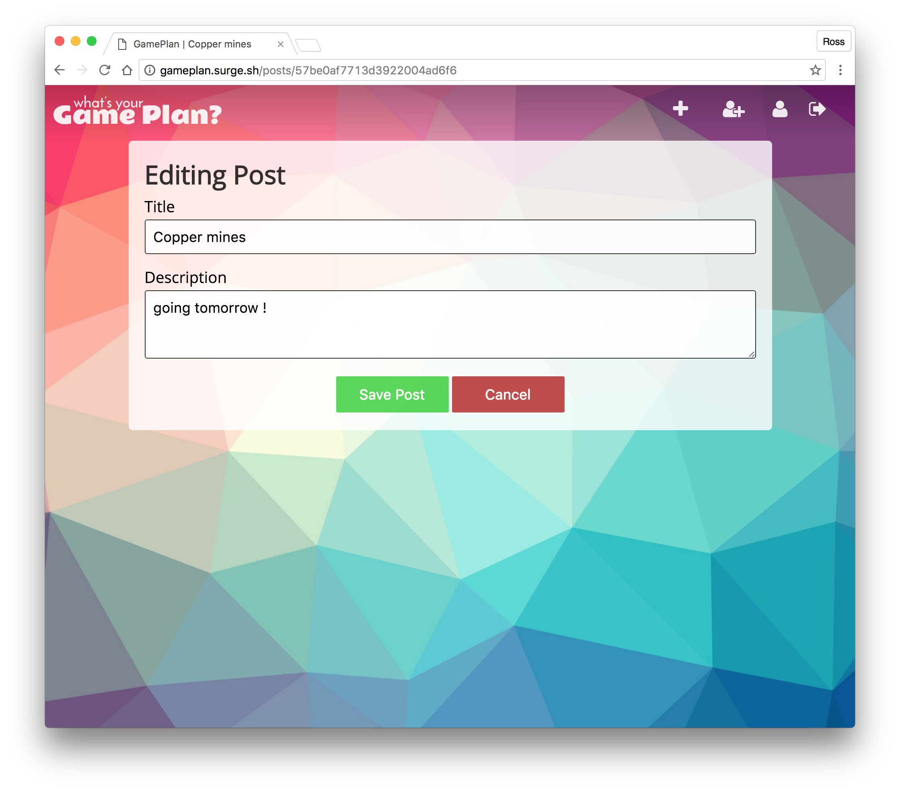
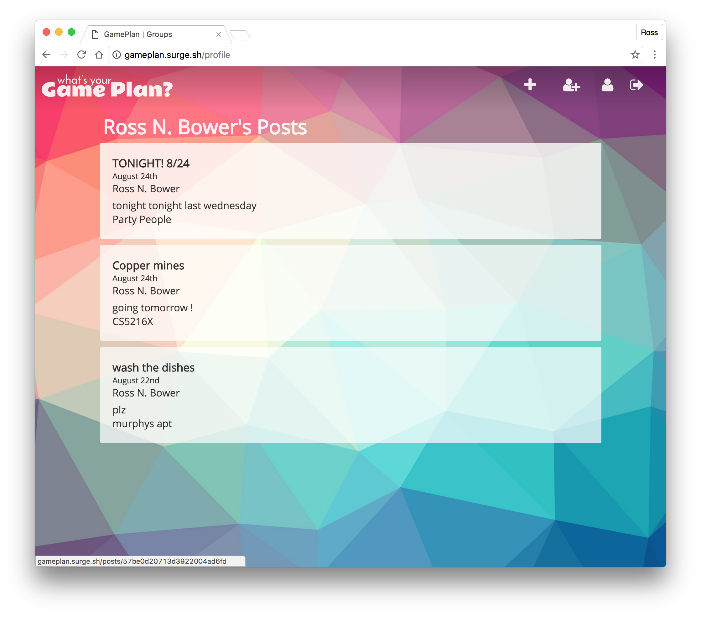

# Game Plan
GamePlan is a web application to facilitate group planning and coordination of events. The app strives to encourage users to step outside their comfort zones and do things they normally never take the time to do! Users can create or be added to groups of other members, and then post event ideas to any groups that they are part of. When a user “likes” a post, they are put in a group chat with all other people who have liked that post, so they can easily communicate about planning this event.

### Login

The user is prompted to log in. Clicking the log in button takes the user through Dartmouth CAS  authentication.

### Home Page/Feed

On the home page, a user can see all of the posts in groups s/he is part of as well as all of the groups s/he is part of. Users are also able to make new posts, make new groups, view their profile, and log out all from the homepage.

### Group View

On a group's page, a user can see the title of the group, a description of the group, and any post associated with that group. Only the owner of the group has a button which allows for a group to be deleted.

### New Group

Upon creating a new group, a user can choose a title and description which can later be edited in addition to adding his/her friends.

### Edit Group

Any user can change the title of a group, the description of the group, and the members within a group.

### Post View (Not a member)

Before joining a post, a user can view a post's title, members, creation date, and description.

### Post View (A member)

Once a post is joined, the user is entered into a chat where s/he can coordinate when to do this event. Users who are not the author of the post are not able to edit any aspect of the post. They only have the option of leaving or joining the post.

### New Post

Users may create a post with a title and description and then share it with as many groups as they would like.

### Edit Post

As previously mentioned, only the author has the ability to edit a post. S/he may edit the title and description of the post.

### Profile

The profile view displays all of a users active posts.

## Architecture
TODO:  descriptions of code organization and tools and libraries used

## Setup
To get to project dev environment up and running, one most change the ROOT_URL in ./src/actions/index.js and this.loginRedirect to run the front end on local servers. Additionally, one must change the service of the CAS within app/controllers/user_controller.js to a local environment. The exact lines of code are commented out for your ease of substitution. One must run `npm start` on the front end and `npm run dev` on the back end.

## Deployment
We set up continuous integration through Travis CI and configured our github to automatically deploy changes to heroku. In order to deploy, one must simply push to a new branch on the repository and then initiate a pull request. 

## Authors
Alex Beals
Kyra Maxwell
Manmeet Gujral
Ross Bower
Sydni Topper

## Acknowledgments
We would like to thank Tim for being Tim and also Basil Beals.
